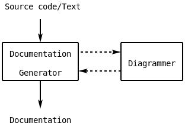

Diagrammer
==========
ASCII diagrams to pictures converter.

It is designed to be a part of an automated workflow, such as
documentation or site generation, as a tool that converts diagrams
drawn in ASCII art technick into bitmaps.

For example, a diagram:
```
   Source code/Text

          |
          v
+--------------------+        +------------+
| Documentation/Site | . . . >| Diagrammer |
|     Generator      |< . . . |            |
+---------+----------+        +------------+
          |
          v

  Documentation/Site
```
will be converted into:




Philosophy
----------
Often diagrams are parts of a source code or some documentation that
must be easily comprehended in its original text representation. For
this reason, ASCII diagrams must not be polluted by special commands
for tools, they are processed by.


Related Projects
----------------
There are several projects with similar functionality:
- [ASCIIToSVG][] (PHP).
- [Asciidiagram][] (Haskell).
- [ditaa][] (Java).
- [Markdeep][] (JavaScript).
- [Shaape][] (Python).
- [Shaky][] (CoffeeScript).

Many of them as well as this one were inspired by 'ditaa'. Thanks to
[Stathis Sideris] for such a great idea!


[ASCIIToSVG]:      https://github.com/dhobsd/asciitosvg
[Asciidiagram]:    https://github.com/Twinside/asciidiagram
[Markdeep]:        https://casual-effects.com/markdeep
[Shaape]:          https://github.com/christiangoltz/shaape
[Shaky]:           https://github.com/dbushong/shaky
[Stathis Sideris]: https://github.com/stathissideris
[ditaa]:           https://github.com/stathissideris/ditaa
